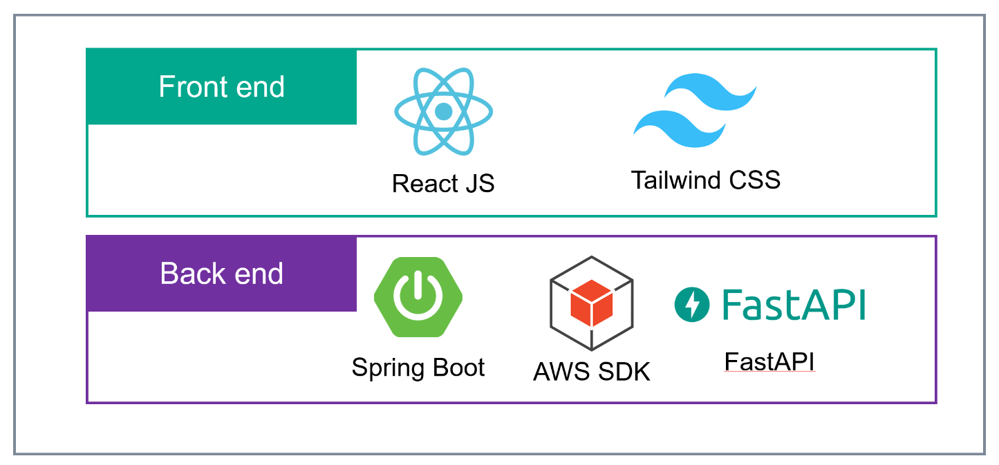
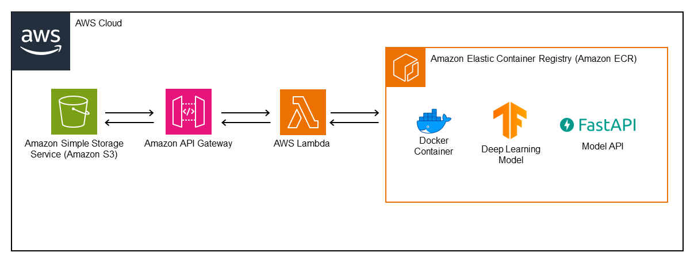
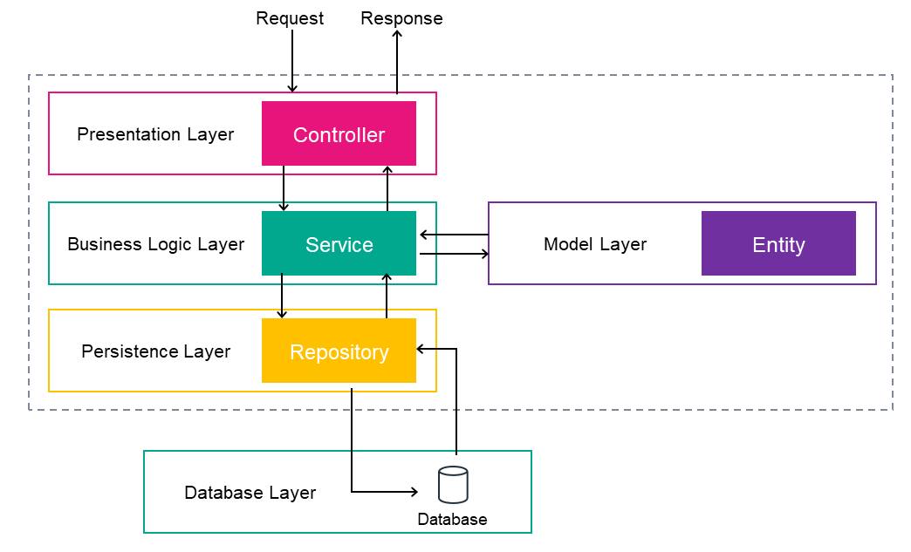

# MEDEYE - Medical Eye Disease Examination Yoked Engagement

## Introduction

MedEye is a full-stack application dedicated to early detection and efficient management of eye diseases. By integrating advanced machine learning algorithms with a user-friendly interface, MedEye provides crucial insights into eye health, aiding in prompt and effective treatment.

## MEDEYE Identity
The name highlights the medical nature, eye disease detection, linking patients and doctors, and driving better engagement around eye health issues.

## Team Members
As passionate data engineering students, we continuously expand our abilities through creative projects that make a meaningful impact.

Our team members are : 

- [EL-BADRAOUI Yassine](https://github.com/yassineiscoding)
- [KHLAIF Mohammed](https://github.com/khlaifmed)
- [SARAB Ayoub](https://github.com/Aysr01)
- [TAQI Anas](https://github.com/anasss008)


## Key Features

- **Eye Disease Detection**: Utilizes a machine learning model trained on retinal images to detect Cataract eye disease.
- **Personalized Patient Notifications**: Alert patients when potential eye diseases are detected, encouraging them to seek professional advice.
- **Doctor Recommendation System**: Links patients with nearby, verified ophthalmologists and optometrists, ensuring they receive appropriate and specialized care.

## Technologies used

### Tech Stack :


### AWS Cloud Architecture (Used for Model Deployment)


### Backend MVC Architecture


### Database:
The project was set using **PostgreSQL**, but any relational database will work

## Installation

```bash
# Clone the repository
git clone https://github.com/anasss008/projet_MedEYE_JEE_2023.git

# Navigate to the frontend directory and install dependencies
cd frontend
npm install

# Navigate to the backend directory and install dependencies
cd ../backend
mvn install
```

## Run

```bash
# Run the frontend
cd frontend
npm run

# Run the backend
cd backend
mvn run
```

```


                                              ./#&&%(*                                  
                                  (@&&&&&&&&&&&&&&&&&&&&&&&&&&@#                       
                            (&&&&&&&&&&@*              %&&&&&&&&&&&&@                  
                        .@&&&&&&&&&&&.                      &&&&&&&&&&&&&@              
                    &&&&&&&&&&&&&@                            &&&&&&&&&&&&&&%          
                %&&&&&&&&&&&&&&&          .@&&&&&&&&&          (&&&&&&&&&&&&&&&#       
              %&&&&&&&&&&&&&&&&&         &&&&&&&&&&&&&&&&        ,&&&&&&&&&&&&&&&&&.    
          /&&&&&&&&&&&&&&&&&&&.       ,&&&&&&&&&&&&&&&&&&        @&&&&&&&&&&&&&&&&&&&  
        &&&&&&&&&&&&&&&&&&&&&&        &&&&&&&&&&&&&&&&&&&@       *&&&&&&&&&&&&&&&&&&&&@
          &&&&&&&&&&&&&&&&&&&&&        &&&&&&&&&&&&&&&&&&&@       #&&&&&&&&&&&&&&&&&&&@ 
            @&&&&&&&&&&&&&&&&&%        &&&&&&&&&&&&&&&&&@        &&&&&&&&&&&&&&&&&&*   
                &&&&&&&&&&&&&&&&(         &&&&&&&&&&&&&@         &&&&&&&&&&&&&&&&&      
                  &&&&&&&&&&&&&&&            /@@@@*           ,&&&&&&&&&&&&&&@         
                      /&&&&&&&&&&&&&                         (&&&&&&&&&&&&&.            
                          *&&&&&&&&&&&&.                  #&&&&&&&&&&&@,                
                              ,&&&&&&&&&&&&@%*...,/@&&&&&&&&&&&&&.                     
                                      (@&&&&&&&&&&&&&&&&@(                            
                                                        
                /$$      /$$ /$$$$$$$$ /$$$$$$$  /$$$$$$$$ /$$     /$$ /$$$$$$$$
                | $$$    /$$$| $$_____/| $$__  $$| $$_____/|  $$   /$$/| $$_____/
                | $$$$  /$$$$| $$      | $$  \ $$| $$       \  $$ /$$/ | $$      
                | $$ $$/$$ $$| $$$$$   | $$  | $$| $$$$$     \  $$$$/  | $$$$$   
                | $$  $$$| $$| $$__/   | $$  | $$| $$__/      \  $$/   | $$__/   
                | $$\  $ | $$| $$      | $$  | $$| $$          | $$    | $$      
                | $$ \/  | $$| $$$$$$$$| $$$$$$$/| $$$$$$$$    | $$    | $$$$$$$$
                |__/     |__/|________/|_______/ |________/    |__/    |________/
                  MEDICAL       EYE     DISEASE  EXAMINATION  YOKED    ENGAGEMENT
                                                                 
                                                                 
                                                                 

```
